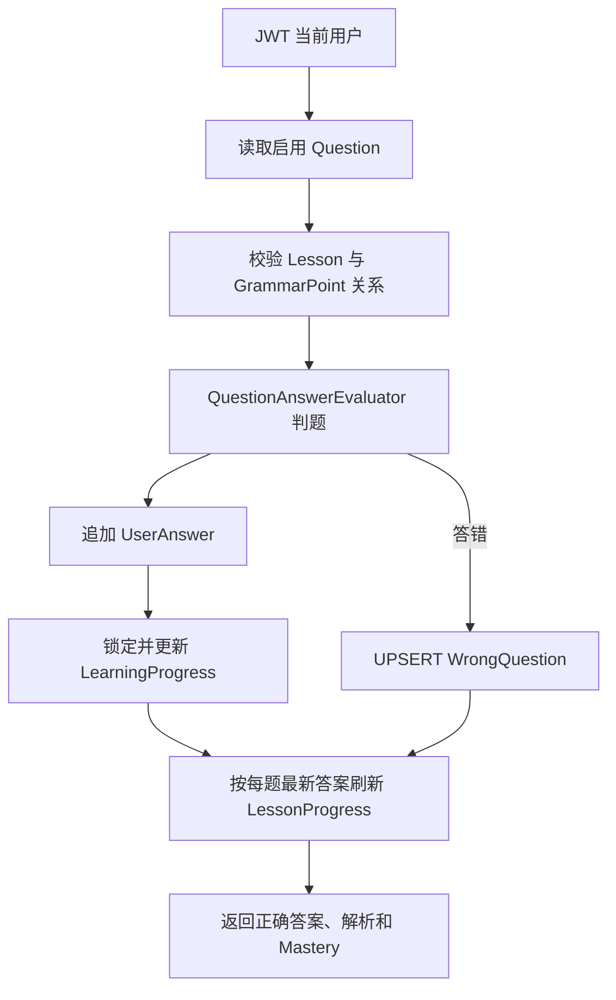

# GrammarAgent 答题学习闭环

本文档描述阶段 5 的确定性判题、答题历史、学习进度、错题和 Lesson 完成规则。所有写接口都从 JWT 认证上下文读取用户 ID，客户端不能指定数据归属。

## Question 获取流程

`GET /api/v1/lessons/{lessonId}/questions` 是公共接口。服务先确认 Lesson 和所属 GrammarPoint 均启用，再查询启用题目，按 `sort_order ASC, id ASC` 稳定排序，最后映射为字段白名单 `QuestionResponse`。

响应只包含题目 ID、题型、题干、选项、难度和顺序，不包含 `correctAnswer`、`explanation`、Entity 或用户字段。

## Submit Answer 流程



`POST /api/v1/questions/{questionId}/answer` 在一个事务中完成查询、判题、历史写入、Mastery 更新、错题更新和 Lesson 进行中状态更新。任何一步失败都会整体回滚。

## AnswerEvaluator 设计

`QuestionAnswerEvaluator` 根据 `QuestionType` 分派六种确定性规则。它不调用 LLM，不做语义猜测，不采用不可解释的模糊匹配。答案 JSON 结构不符合对应题型时返回 `40010`。

## 六种题型判题规则

| 题型 | 第一版规则 |
| --- | --- |
| `SINGLE_CHOICE` | 比较选项 ID；请求可使用字符串或 `{ "optionId": "A" }`。 |
| `MULTIPLE_CHOICE` | 比较选项 ID 集合，选择顺序不影响结果。 |
| `FILL_BLANK` | 单文本答案执行 Unicode NFKC、首尾去空格、合并连续空白和大小写归一化，再与允许答案比较。 |
| `SENTENCE_ORDER` | 严格比较 token 数组顺序，仅去除每个 token 的首尾空格。 |
| `TRUE_FALSE` | 严格要求 JSON boolean，不把字符串 `"true"` 当作布尔值。 |
| `CORRECTION` | 使用与填空相同的基础字符串标准化后精确比较，不做语义或模糊匹配。 |

## UserAnswer 设计

每次提交都向 `user_answers` 插入新行，保存原始 JSONB 答案、判题结果、时长和答题时间。同一题重复提交会保留多条记录，历史从不覆盖。

Lesson 状态计算使用 PostgreSQL `DISTINCT ON (question_id)`，按 `answered_at DESC, id DESC` 选择当前用户对每道题的最新记录。

## WrongQuestion 更新规则

答错时按 `(user_id, question_id)` 执行 PostgreSQL `INSERT ... ON CONFLICT DO UPDATE`：首次设置 `wrong_count = 1`，以后原子加一；`last_wrong_at` 更新为当前时间，`next_review_at` 固定为当前时间后 1 天，`mastered = false`。

后来答对不会删除错题，也不会自动标记掌握，留给后续 Review 流程处理。

## MasteryScore 第一版公式

`user_learning_progress` 表示累计答题行为。每次提交使 `total_questions + 1`，答对时再使 `correct_questions + 1`。

```text
masteryScore = round(correctQuestions × 100 / totalQuestions)
```

结果保存为 0–100 整数。更新前通过 `ON CONFLICT DO NOTHING` 保证聚合行存在，再用 `SELECT ... FOR UPDATE` 锁定，避免并发丢失增量。

## Lesson Completion 计算逻辑

`POST /api/v1/lessons/{lessonId}/complete` 查询 Lesson 的全部启用题目，以及当前用户对这些题目的最新答案。缺少任意一道题时返回 `40910`，不会完成 Lesson。

全部答过后：

```text
totalCount   = Lesson 启用题目总数
correctCount = 每道题最新答案中正确的数量
score        = round(correctCount × 100 / totalCount)
status       = COMPLETED
```

完成结果通过 `(user_id, lesson_id)` UPSERT 写入，并设置 `completed_at`。

## XP 第一版规则

单题提交不持久化 XP，响应 `xpEarned = 0`。完成 Lesson 时一次性计算：

```text
xpEarned = floor(lesson.xpReward × correctCount / totalCount)
```

XP 仅保存在 `user_lesson_progress.xp_earned`，没有提前引入可无限累计的全局 XP 表。

## 为什么正确答案只能在提交后返回

Question GET 面向课程学习内容，若提前返回正确答案或解析，客户端、代理日志和浏览器调试工具都可能直接泄题。项目使用独立的 `QuestionResponse` 白名单模型，从类型层面排除这些字段。只有完成一次答案提交并经过后端判定后，`SubmitAnswerResponse` 才返回该题的标准答案和固定解析。
