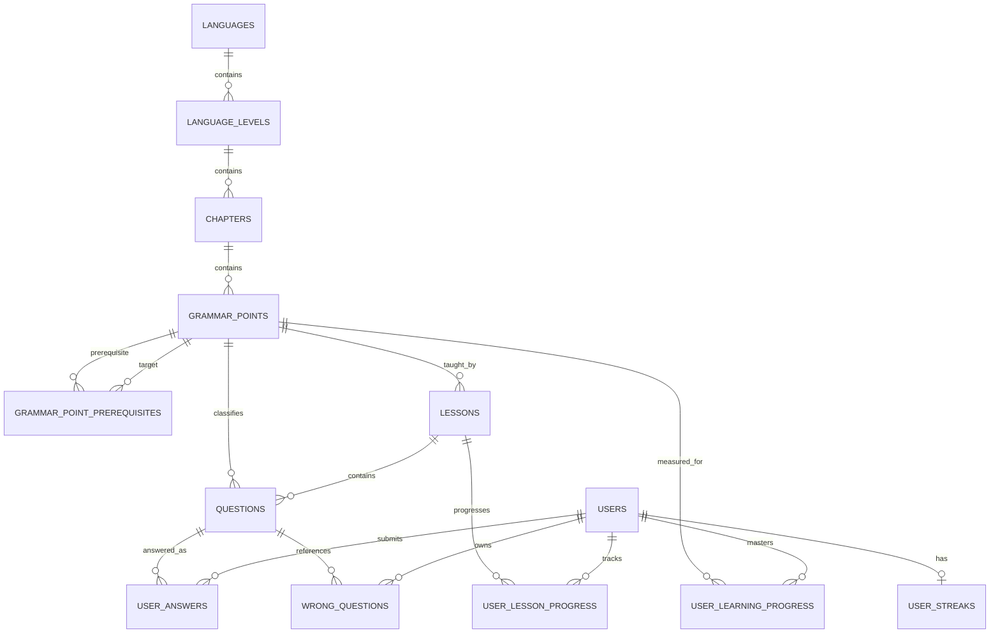

# GrammarAgent 核心数据库设计

本文档描述阶段 2 的 PostgreSQL 核心领域模型。数据库结构由 Flyway 管理，应用不使用 JPA/Hibernate 自动建表。生产结构迁移位于 `backend/src/main/resources/db/migration/`，仅本地启用的开发种子位于 `backend/src/main/resources/db/dev-migration/`。

## 设计约定

- 表名和列名使用 `snake_case`；Java Entity 与字段分别使用 `PascalCase` 和 `camelCase`。
- 主键统一为 PostgreSQL `BIGINT GENERATED BY DEFAULT AS IDENTITY`，Java 类型为 `Long`。这一方案简单、可观测，适合当前模块化单体，不提前引入 UUID 或雪花 ID。
- 时间点使用 PostgreSQL `TIMESTAMPTZ` 和 Java `OffsetDateTime`；仅自然日字段 `last_learning_date` 使用 `DATE` / `LocalDate`。
- 核心表均包含 `id`、`created_at`、`updated_at`。数据库默认值保证 SQL 直写安全，MyBatis-Plus `MetaObjectHandler` 负责应用写入时自动填充审计时间。
- 内容数据通常通过 `enabled` 下线而不物理删除，因此课程树外键使用 `ON DELETE RESTRICT`；用户派生数据在删除用户时使用 `ON DELETE CASCADE`。
- Entity 是持久化模型，不能由 Controller 直接返回。后续 API 必须使用 DTO/VO。

## ER 关系

主学习路径是 `languages → language_levels → chapters → grammar_points → lessons → questions`。用户答题历史是追加记录；关卡进度、语法掌握度、错题和连续学习记录则按各自唯一业务键聚合。

## 表职责与主要字段

| 表 | 职责 | 主要字段 |
| --- | --- | --- |
| `users` | 用户账户基础资料 | `email`、`username`、`password_hash`、`status`、`last_login_at` |
| `languages` | 可学习语言目录 | `code`、`name`、`native_name`、`enabled`、`sort_order` |
| `language_levels` | 某语言下的能力等级 | `language_id`、`code`、`description`、`sort_order` |
| `chapters` | 等级内的有序章节 | `language_level_id`、`title`、`enabled`、`sort_order` |
| `grammar_points` | 语法规则、示例和常见错误 | `chapter_id`、`code`、`grammar_rule`、`examples`、`common_errors`、`difficulty` |
| `grammar_point_prerequisites` | 语法点的直接前置依赖边 | `grammar_point_id`、`prerequisite_grammar_point_id` |
| `lessons` | 围绕语法点组织的学习单元 | `grammar_point_id`、`lesson_type`、`xp_reward`、`sort_order` |
| `questions` | 关卡题目及内部标准答案 | `lesson_id`、`grammar_point_id`、`question_type`、`options`、`correct_answer`、`explanation` |
| `user_answers` | 每一次答题事实记录 | `user_id`、`question_id`、`answer`、`is_correct`、`duration_ms`、`answered_at` |
| `user_lesson_progress` | 用户在某 Lesson 上的聚合进度 | `status`、`score`、计数、XP、开始/完成时间 |
| `user_learning_progress` | 用户对某 GrammarPoint 的聚合掌握度 | `mastery_score`、答题计数、`last_study_at` |
| `wrong_questions` | 用户维度的去重错题记录和复习调度 | `wrong_count`、`last_wrong_at`、`next_review_at`、`mastered` |
| `user_streaks` | 每个用户一条连续学习汇总 | `current_streak`、`max_streak`、`last_learning_date` |

### 用户名和登录扩展

`email` 通过 `LOWER(email)` 唯一索引实现大小写不敏感唯一。后续注册服务还应在写入前执行去空格和规范化。`username` 被定义为非空但不唯一，把它视为可重复的展示名称，避免用户名抢注和改名限制；未来若产品需要唯一公开账号，应通过独立字段和后续 migration 增加。

`password_hash` 允许为空，只保存哈希而不保存明文。这样未来 Google / Apple 登录用户可以没有本地密码，同时无需在本阶段提前设计 OAuth 表。

### Lesson 进度状态

数据库只保存 `IN_PROGRESS` 和 `COMPLETED`。`NOT_STARTED` 不创建记录：没有 `(user_id, lesson_id)` 行就代表尚未开始，可减少大量无意义稀疏数据。

## 约束

### 唯一约束

- `users`: `LOWER(email)` 唯一；`username` 有意不唯一。
- `languages`: `code`。
- `language_levels`: `(language_id, code)`。
- `chapters`: `(language_level_id, sort_order)`。
- `grammar_points`: `(chapter_id, code)`。
- `grammar_point_prerequisites`: `(grammar_point_id, prerequisite_grammar_point_id)`。
- `lessons`: `(grammar_point_id, sort_order)`。
- `questions`: `(lesson_id, sort_order)`。
- `user_lesson_progress`: `(user_id, lesson_id)`。
- `user_learning_progress`: `(user_id, grammar_point_id)`。
- `wrong_questions`: `(user_id, question_id)`。
- `user_streaks`: `user_id`。

### 检查约束

- 用户、题型、Lesson 类型和 Lesson 进度状态限制为 Java 枚举对应的字符串值。
- `difficulty` 为 1–5，`score` 和 `mastery_score` 为 0–100。
- 答题计数、XP、时长、错题次数和连续天数不能为负；正确数不能大于总题数。
- `COMPLETED` 必须有 `completed_at`，`IN_PROGRESS` 不能有完成时间。
- 前置依赖不能指向自身，并由唯一约束禁止重复边。更长的循环依赖无法用简单 `CHECK` 表达，后续写入服务需要在事务内检测有向环。

### 主要外键

- 内容树：`language_levels.language_id`、`chapters.language_level_id`、`grammar_points.chapter_id`、`lessons.grammar_point_id`。
- 题目同时关联 `lesson_id` 与 `grammar_point_id`，便于按 Lesson 出题和按语法点统计；后续写入服务必须校验二者一致。
- `grammar_point_prerequisites` 的两端都关联 `grammar_points`，删除语法点时依赖边级联删除。
- 用户学习数据均关联 `users`；用户删除时级联清理。题目、Lesson 和 GrammarPoint 被学习数据引用时禁止物理删除。

## 索引策略

唯一约束自带的 B-tree 索引用于大多数主从查询。额外索引只覆盖预期高频路径：

- 内容路径：章节、语法点、Lesson、题目的父 ID + `enabled` + `sort_order`。
- 前置图反向查找：`prerequisite_grammar_point_id`。
- 答题历史：`(user_id, answered_at DESC)` 与 `(question_id, answered_at DESC)`。
- 题目按语法点聚合：`questions.grammar_point_id`。
- 进度反向统计：Lesson 或 GrammarPoint 外键列。
- 待复习错题：`(user_id, mastered, next_review_at)`。

没有为低选择性布尔字段单独建索引，也没有机械地为每列建索引。

## JSONB 设计

| 字段 | 原因 |
| --- | --- |
| `grammar_points.examples` | 示例可逐步增加句子、翻译、提示等结构，数组比拆分小表更适合整体读取。 |
| `grammar_points.common_errors` | 常见错误通常随语法点整体维护，结构会随内容策略演进。 |
| `questions.options` | 单选、多选、排序等题型的选项结构不同，填空和改错可为空。 |
| `questions.correct_answer` | 不同题型分别需要选项 ID、答案数组、布尔值或有序 token。 |
| `user_answers.answer` | 保存用户当次提交的原始结构，支持所有题型并便于复盘。 |

JSONB 只用于形态确实多变且整体读写的数据；稳定的关联、排序、状态和统计值仍使用普通列，以保留约束和查询能力。

## GrammarPoint prerequisite

`grammar_point_prerequisites` 是 GrammarPoint 到 GrammarPoint 的有向邻接表。每行表示“学习 `grammar_point_id` 前应先掌握 `prerequisite_grammar_point_id`”。这一结构足以支持拓扑排序、解锁判断和知识图谱可视化，不需要当前引入 Neo4j。数据库负责禁止自依赖和重复直接依赖，业务层未来负责检测间接环。

## MasteryScore

`mastery_score` 使用 0–100 的整数并由数据库 `CHECK` 约束。它是可展示、可排序的聚合结果；`total_questions`、`correct_questions` 和 `last_study_at` 保留计算上下文。本阶段不定义算法，后续可以综合正确率、时间衰减、题目难度和复习表现计算，而不改变表结构。

## Question Entity 与客户端 VO 分离

`Question` Entity 必须包含 `correctAnswer` 才能判题，但客户端获取题目时绝不能收到该字段。依赖序列化注解“隐藏一个字段”容易在新接口、日志或对象转换中被绕过。因此后续应建立：

1. 持久化 `Question` Entity：包含完整内部字段。
2. 业务 DTO：按判题或课程编排场景承载所需数据。
3. 客户端 Question VO：显式白名单字段，不定义 `correctAnswer`。

本阶段没有 Controller 或业务接口，因此只建立 Entity，禁止直接把它作为未来 Controller 返回值。

## 开发种子数据

开发数据使用 `R__seed_english_a1.sql`，只由 `application-local.yml` 的额外 Flyway location 加载。它包含 English、A1、“基础句子”、“be 动词基础”、一个 Lesson 和 5 道覆盖多种题型的示例题。

选择本地可重复 migration 的原因：

- 核心语言目录和开发题目不会自动进入生产环境。
- SQL 使用业务唯一键和 `ON CONFLICT`，可重复执行并随内容修改更新。
- Flyway 仍会记录校验和和执行状态，开发环境可复现，不依赖手工脚本。
