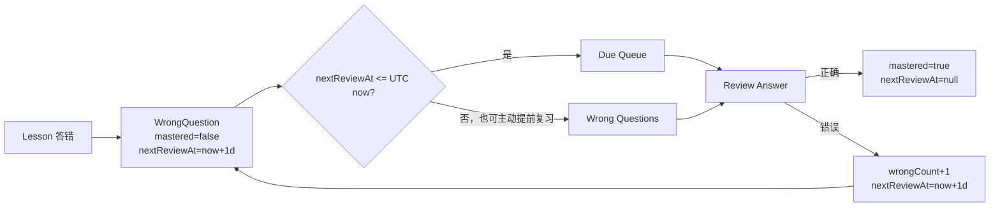

# GrammarAgent 错题 Review 闭环

本文档描述阶段 6A 的错题查询、复习判题和状态变化。全部 Review API 要求 JWT；`userId`、`mastered`、`wrongCount` 和 `nextReviewAt` 均由服务端确定。

## WrongQuestion 生命周期



普通 Lesson 答错会创建或更新唯一的 `(user_id, question_id)` 错题行。普通 Lesson 后来答对仍保留 `mastered=false`，只有用户在 Review 场景答对，才视为完成一次明确的掌握确认。

## Due Queue 定义

`GET /api/v1/reviews/due?limit=20` 只查询当前用户、启用题目，并满足：

```text
mastered = false
next_review_at <= backend UTC now
```

排序为 `next_review_at ASC, wrong_count DESC, id ASC`。`limit` 默认 20，范围 1–100。due 是推荐队列，不是访问锁；只要错题尚未掌握，用户可以在到期前主动提交 Review。

## Wrong Questions 与 Due 的区别

`GET /api/v1/reviews/wrong-questions?page=1&size=20` 返回当前用户全部未掌握错题，包括未来才到期的题目，按 `wrong_count DESC, next_review_at ASC, id ASC` 排序。`size` 最大 100，避免一次返回大量数据。

两个查询都返回 `ReviewQuestionResponse`：错题状态加安全的 `QuestionResponse`。它们不返回 `correctAnswer` 或 `explanation`。

## Review Summary

`GET /api/v1/reviews/summary` 返回：

- `dueCount`：当前已到期且未掌握的数量；
- `unmasteredCount`：全部未掌握数量；
- `masteredCount`：历史已掌握数量；
- `nextReviewAt`：所有未掌握错题中最早的复习时间，没有未掌握题时为 `null`。

所有时间均为 UTC `OffsetDateTime`，客户端时间不参与 due 判断。

## Review Answer 流程

`POST /api/v1/reviews/questions/{questionId}/answer` 复用阶段 5 的 `SubmitAnswerRequest` 和 `QuestionAnswerEvaluator`。事务依次完成：验证启用 Question 及内容关系、锁定当前用户的 WrongQuestion、拒绝不存在或已掌握项、确定性判题、追加 UserAnswer、更新 LearningProgress、更新 WrongQuestion，并在提交后返回正确答案和固定解析。

任一步失败都会整体回滚。客户端不能传入或覆盖用户与复习状态字段。

## ReviewScheduler 设计

`ReviewScheduler` 集中管理时间规则。MVP 只有一个可解释策略：

```text
incorrect review -> nextReviewAt = reviewedAt + 1 day
correct review   -> mastered = true, nextReviewAt = null
```

没有把累计 `wrongCount` 伪装成成熟的间隔等级。未来接入 SM-2 或 FSRS 时可替换调度器，不需要改 Controller 或判题器。

## 答对与答错状态

Review 答对一次：保留历史 `wrongCount` 和 `lastWrongAt`，设置 `mastered=true`、`nextReviewAt=null`，随后不再出现在 due 或未掌握错题列表。再次提交同一已掌握项返回 `40920`，且不会新增 UserAnswer。

Review 答错：`wrongCount+1`、`lastWrongAt=now`、`mastered=false`、`nextReviewAt=now+1 day`。

## UserAnswer 与 Mastery

每次有效 Review 都新增 UserAnswer，不覆盖 Lesson 或以往 Review 历史。Review 同样是学习行为，因此复用 LearningProgress 与 MasteryCalculator：

```text
totalQuestions += 1
correctQuestions += correct ? 1 : 0
masteryScore = round(correctQuestions * 100 / totalQuestions)
```

## 为什么 Review 不修改 LessonProgress

LessonProgress 保存当次课程完成成绩。Review 是之后独立发生的巩固行为，因此不会改变 `correctCount`、`totalCount`、`score`、`xpEarned` 或完成时间。例如 Lesson 的 4/5、80 分在复习答对后仍保持不变。阶段 6A Review 也不发放持久化 XP。

## 并发与查询性能

Review 提交使用 `(user_id, question_id)` WrongQuestion 行的 `SELECT ... FOR UPDATE`，同一用户同一道题的快速重复提交会串行执行，防止错误次数或 mastered 状态丢失。聚合更新保持 WrongQuestion 后 LearningProgress 的一致锁顺序。

列表先一次查询 WrongQuestion，再通过一条 `IN` 查询批量加载启用 Question，避免逐题查询造成 N+1。Summary 使用单条条件聚合 SQL。

## MVP 当前限制与升级方向

当前没有 ReviewSession/ReviewAttempt、新表、Redis 队列、定时推送、复杂遗忘曲线或全局 XP。下一版如需要复习历史分轮、学习设备同步和更科学的间隔，可在保持 Review API 边界的基础上新增 attempt 模型，并将 `ReviewScheduler` 替换为经过验证的 SM-2/FSRS 实现。
